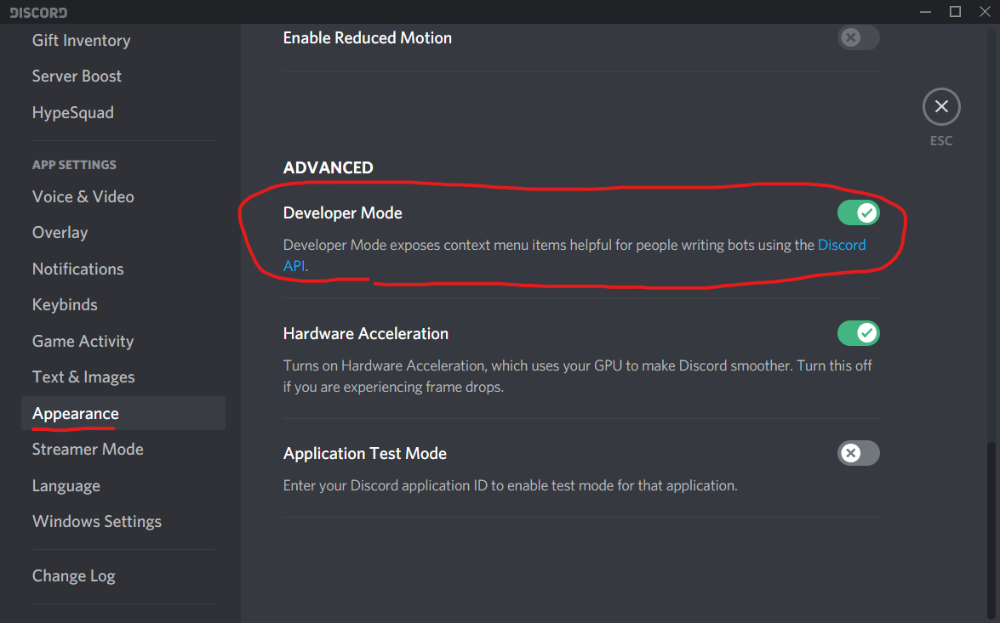

# helpbot

- [helpbot](#helpbot)
  - [Current features](#current-features)
  - [All available commands](#all-available-commands)
  - [Work in progress](#work-in-progress)
  - [Setup](#setup)
    - [Creating a discord application and bot user](#creating-a-discord-application-and-bot-user)
    - [Discord server setup](#discord-server-setup)
    - [Obtaining Discord IDs](#obtaining-discord-ids)
    - [Configuring the bot](#configuring-the-bot)

A discord bot to help teaching assistants keep track of students who need help.

This bot manages a queue of students who request help from teaching assistants.

## Current features

- Students can request help using "!gethelp" or request approval of an assignment using "!approve"
- Students can cancel their request using "!cancel"
- Students receive a message when a teaching assistant is ready to help.

- Teaching assistants can get the next help request using "!next"
  - If the queue is empty, the teaching assistant will receive a notification when the next student requests help.
- Teaching assistants can view the queue.
- Teaching assistants can clear the queue.

## All available commands

All roles:

- help - displays help text and a list of commands

No role:

- register - assigns the user a nickname and student role based on info from GitHub/Autograder

Student role:

- gethelp - assigns a teaching assistant to help the student, if available. Otherwise the student is put at the back of the queue.
- approve - same as gethelp, but meant to be used for assignment approvals.
- status - shows the student's current position in the queue
- cancel - cancels the help request (student is removed from the queue)

Teaching assistant role:

- next - the teaching assistant is assigned the next student in the queue.
  If empty, the teaching assistant will be "waiting", and will be assigned the next student who needs help.
- cancel - the teaching assistant can remove their "waiting" status.
- length - Returns the number of students waiting in the queue.
- list (n=10) - Returns the "n" next students in the queue.
- clear - removes all students from the queue.
- unregister (@mention student) - unregisters the mentioned student.

## Work in progress

- Registration is halfway implemented:
  - Currently, new users can become "registered" by using the command "!register" and typing their GitHub username.
    The bot will then check if that GitHub username has access to the course's GitHub organization.
    If enabled, the bot will also get the student's real name from autograder.
  - In the future, this should be properly authenticated using Oauth either using the GitHub API, or by using Discord connections.
  - When the bot has confirmed that the user has access to GitHub/autograder, the bot will automatically assign a nickname and roles.
- Joining multiple servers
  - Currently, you must run a new instance of the bot for each server.

## Setup

### Creating a discord application and bot user

Go to the [Discord Developer Portal](https://discord.com/developers) and create a new application.
Next, click on the "bot" page and add a bot user.
Here you can set the bot username and icon.
You will also find the *bot token*, which is needed to start the bot.

### Discord server setup

Your discord server needs to provide two different roles: one for students, and one for teaching assistants.
You should also ensure that the bot has read access to all of the text channels that it needs to be able to monitor.
The bot can, however, operate entirily through direct messages (DMs), and this is the intended way for the bot to be used.

### Obtaining Discord IDs

The bot uses Discord IDs for configuration. You can find these by turning on developer mode in Discord settings:


You can then copy discord IDs by right clicking a role or a channel, for example:


### Configuring the bot

A config file must be named `.helpbotrc`. The default syntax is TOML.
You may specify a different file extension, for example ".yml" or ".json" if you prefer a different markup language.

Discord IDs are obtained as explained above.

The following configuration variables are available

```toml
db-path = "<path to sqlite database file>" # if empty, an in-memory database will be used
token = "<discord bot token>"              # the token that you got from the Discord Developer Portal
prefix = "!"                               # the prefix used before each command, for example !help
guild = <discord id>                       # the id of the server
student-role = <discord id>                # the id of the student role
assistant-role = <discord id>              # the id of the teaching assistant role
help-channel = <discord id>                # the id of the text channel where students can ask for help (can be ignored; may be removed in the future)
lobby-channel = <discord id>               # the id of the voice channel where students can wait for help (may be removed in the future)
gh-token = "<github access token>"         # github access token with `read:org` access to the relevant github organization
gh-org = "<github org name>"               # the name of the course's github organization
```

The follwing configuration variables are available to enable autograder support:

```toml
autograder = true             # enable autograder support
autograder-user-id = 1        # the user id to use with autograder
course-code = "<course code>" # the course code to use with autograder
course-year = 2020            # the year of the course
```
